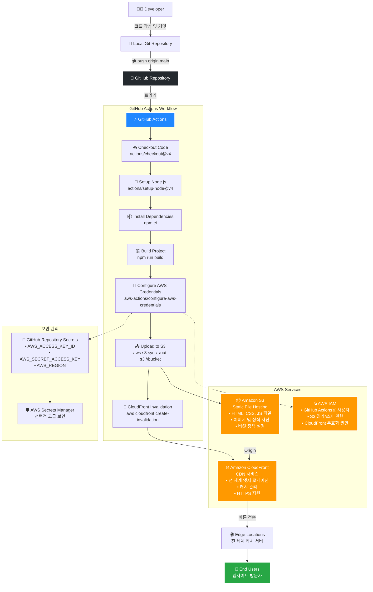
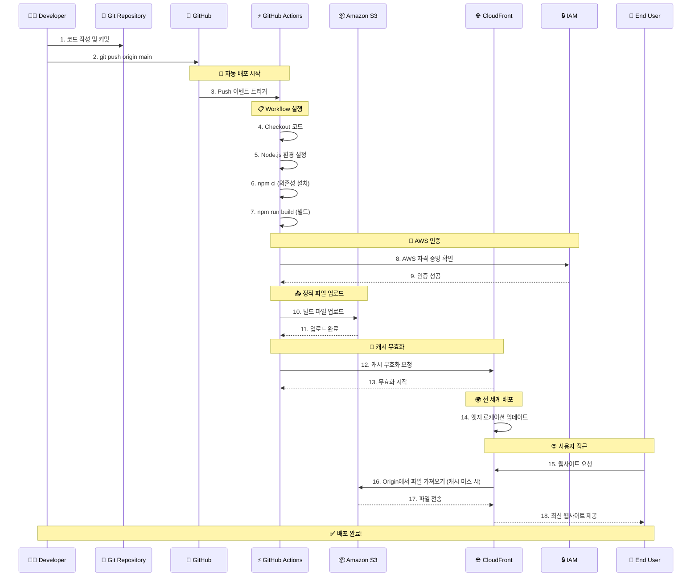

# Chapter 4-1. 인프라 관점의 성능 최적화

## 프론트엔드 배포 파이프라인

## 목차

[개요](#개요)  
[주요 단계별 설명](#주요-단계별-설명)  
  - [GitHub Actions](#1-github-actions)  
  - [Amazon S3](#2-amazon-s3---안정적인-웹-호스팅)  
  - [Amazon CloudFront](#3-amazon-cloudfront---글로벌-성능-최적화)  
  - [IAM과 보안](#4-iam과-보안)  
[주요 링크](#주요-링크)  
[주요 개념](#주요-개념)  
  - [GitHub Actions과 CI/CD](#github-actions과-cicd-도구)  
  - [S3와 스토리지](#s3와-스토리지)  
  - [CloudFront와 CDN](#cloudfront와-cdn)  
  - [캐시 무효화](#캐시-무효화cache-invalidation)  
  - [Route53과 DNS 서비스](#route53과-dns-서비스)  
[CDN과 성능 최적화 비교](#cdn과-성능최적화)  
[추가 학습 포인트](#추가-학습-포인트)  
[질문](#질문)

### 개요

#### 파이프라인 다이어그램 (diagrams)


#### 파이프라인 플로우 차트



#### 파이프라인 시퀀스 다이어그램



### 주요 단계별 설명

#### 1. GitHub Actions

워크플로우 구성: `main` 브랜치에 push 이벤트가 발생하면 배포가 자동으로 진행됩니다.

- 주요 작업:
  - Checkout: 저장소 코드를 내려받습니다.
  - `npm ci`: CI/CD 환경에 맞춰 프로젝트 의존성 설치
  - `npm run build`: Next.js 빌드 산출물 생성(out/)
  - AWS 자격 증명 설정: IAM 역할을 활용해 AWS 리소스에 안전하게 접근
  - S3로 빌드 결과물 업로드: 정적 파일을 S3 버킷에 배포
  - CloudFront 캐시 무효화 수행: 캐시가 이전 파일을 보여주지 않도록 Invalidation 실행

#### 2. Amazon S3 - 안정적인 웹 호스팅

Next.js 빌드된 정적 파일을 저장하는 버킷 역할을 합니다. 전통적인 웹 서버 없이도 정적 자산을 안전하게 저장하고 웹사이트로 서비스할 수 있습니다.
정적 자산(HTML, JS, CSS)을 S3에서 호스팅합니다. 트래픽 급증 시에도 자동으로 확장되어 안정적인 서비스를 제공합니다.

#### 3. Amazon CloudFront - 글로벌 성능 최적화

S3에서 가져온 파일을 전 세계 엣지 서버로 배포합니다. 사용자에게 더 빠르고 안정적으로 콘텐츠를 전달합니다.
새로 배포된 파일로 캐시 무효화가 진행되어 전 세계 사용자가 동시에 최신 버전을 경험할 수 있습니다.

#### 4. IAM과 보안

GitHub Actions가 S3와 CloudFront에 접근할 수 있도록 IAM 역할(정책)을 구성했습니다.
AWS Secrets Manager나 GitHub Repository Secrets를 활용해 자격 증명을 안전하게 관리합니다.

---

### 주요 링크

- S3 버킷 웹사이트 엔드포인트: http://hanghae-yubin-bucket.s3-website-us-east-1.amazonaws.com
- CloudFrount 배포 도메인 이름: https://d116nkzjkpdj0x.cloudfront.net

---

### 주요 개념

- #### GitHub Actions과 CI/CD 도구

  GitHub Actions는 GitHub에서 제공하는 자동화 워크플로 도구입니다.
  CI(지속적 통합), CD(지속적 배포)를 자동화해주는 역할을 합니다.
  예를 들어, 코드 push 시 자동으로 테스트, 빌드, 배포 과정을 실행합니다.
  이를 통해 배포 오류를 줄이고, 일관된 개발 파이프라인을 유지할 수 있습니다.

  **예시 워크플로우**

  ```
  name: Deploy to S3
  on:
    push:
      branches: [main]
  jobs:
    deploy:
      runs-on: ubuntu-latest
      steps:
        - uses: actions/checkout@v4
        - name: Setup Node.js
          uses: actions/setup-node@v4
          with:
            node-version: '18'
        - run: npm ci
        - run: npm run build
        - name: Deploy to S3
          run: aws s3 sync ./build s3://my-bucket
  ```

- #### S3와 스토리지

  S3는 Amazon Web Services의 객체 스토리지 서비스입니다.
  정적 웹사이트 파일(html, css, js)이나 이미지, 동영상 같은 파일을 저장·서빙합니다.
  높은 내구성(99.999999999%)과 가용성을 제공해, 안전하게 정적 파일을 저장할 수 있습니다.

  **S3 버킷 구조 예시**

  ```
  my-website-bucket/
    ├── index.html
    ├── about.html
    ├── css/
    │   ├── styles.css
    │   └── bootstrap.min.css
    ├── js/
    │   ├── app.js
    │   └── jquery.min.js
    └── images/
        ├── logo.png
        └── hero-bg.jpg
  ```

  **AWS CLI로 파일 업로드**

  ```
  # 단일 파일 업로드
  aws s3 cp index.html s3://my-bucket/

  # 폴더 전체 동기화
  aws s3 sync ./build s3://my-bucket --delete

  # 정적 웹사이트 호스팅 설정
  aws s3 website s3://my-bucket --index-document index.html
  ```

- #### CloudFront와 CDN

  CloudFront는 AWS의 CDN(콘텐츠 전송 네트워크) 서비스입니다.
  S3 같은 저장소에서 정적 파일을 가져와 전 세계 엣지 로케이션으로 배포해, 사용자에게 더 빠르게 콘텐츠를 전달합니다.
  CDN은 글로벌 사용자에게 콘텐츠를 빠르게 제공하고, 서버 부하를 줄여줍니다.

  **CDN 작동 원리**

  ```
  사용자(서울) → 한국 엣지 서버 → 콘텐츠 전달 (빠름 ⚡)
          vs
  사용자(서울) → 미국 Origin 서버 → 콘텐츠 전달 (느림 🐌)
  ```

- #### 캐시 무효화(Cache Invalidation)

  캐시 무효화는 CDN이나 브라우저에 저장된 캐시를 지우는 작업입니다.
  사이트를 업데이트하면, 사용자에게 이전 버전 캐시가 남아있을 수 있습니다.
  이때 캐시 무효화를 통해 최신 콘텐츠로 빠르게 갱신할 수 있습니다.
  예) CloudFront의 Invalidation API를 사용해서 특정 경로 캐시를 제거.

  **CloudFront 캐시 무효화 명령어**

  ```
  # 전체 캐시 무효화
  aws cloudfront create-invalidation \
   --distribution-id E1234567890123 \
   --paths "/*"

  # 특정 파일만 무효화
  aws cloudfront create-invalidation \
   --distribution-id E1234567890123 \
   --paths "/index.html" "/css/styles.css"
  ```

  **캐시 무효화 과정**

  1. 새 파일 업로드 → S3
  2. 캐시 무효화 실행 → CloudFront
  3. 전 세계 엣지 서버 캐시 삭제
  4. 사용자 요청 시 → 새 파일 전달

- #### Repository secret과 환경변수

  Repository secret은 GitHub Actions 등에서 민감 정보를 안전하게 관리하는 방식입니다.
  예를 들어, 배포용 API 키, 데이터베이스 비밀번호 등을 저장하고, 워크플로에서 환경 변수로 불러와 사용합니다.
  이를 통해 보안을 유지하면서도 자동화 파이프라인을 안전하게 실행할 수 있습니다.

  **GitHub Repository Secrets 설정**

  ```
  Settings → Secrets and variables → Actions

  필요한 Secrets:
    - AWS_ACCESS_KEY_ID: AKIA...
    - AWS_SECRET_ACCESS_KEY: wJalr...
    - AWS_REGION: us-east-1
    - S3_BUCKET_NAME: my-website-bucket
  ```

  **워크플로우에서 Secret 사용**

  ```
    - name: Configure AWS credentials
      uses: aws-actions/configure-aws-credentials@v1
      with:
        aws-access-key-id: ${{ secrets.AWS_ACCESS_KEY_ID }}
        aws-secret-access-key: ${{ secrets.AWS_SECRET_ACCESS_KEY }}
        aws-region: ${{ secrets.AWS_REGION }}

    - name: Deploy to S3
      run: |
        aws s3 sync ./build s3://${{ secrets.S3_BUCKET_NAME }}
  ```

- #### Route53과 DNS 서비스

  Route 53은 AWS의 DNS(도메인 네임 시스템) 관리 서비스입니다.
  S3 또는 CloudFront에 배포된 웹사이트에 도메인(예: www.example.com)을 연결할 수 있습니다.
  사용자는 Route 53을 통해 사용자 지정 도메인과 연결된 트래픽을 전 세계적으로 안정적이고 빠르게 라우팅할 수 있습니다.
  실무에선 Route 53을 사용해 도메인 등록 → S3/CloudFront와 연결 → HTTPS 인증서 발급까지 진행하는 경우가 많습니다.

  **도메인 연결 전체 흐름**

  1. 도메인 구매 (Route 53 또는 외부)
  2. Route 53 호스팅 존 생성
  3. DNS 레코드 설정 (A, CNAME)
  4. SSL 인증서 발급 (ACM)
  5. CloudFront에 도메인 연결
  6. 사용자 접근: mysite.com → Route 53 → CloudFront → S3

---

### CDN과 성능최적화

##### S3와 CloundFront


#### 테스트 환경

- 오리진: Amazon S3 정적 파일 호스팅 (us-east-1)
- CDN: Amazon CloudFront 배포 (엣지 로케이션 캐시 적용)
- 테스트 방식: 크롬 개발자 도구 네트워크 탭, 캐시 무효화 후 새로고침 (Hard Reload)
- 주요 로드 항목: HTML, JS, CSS, 이미지, 폰트 등 약 20개

#### 측정 결과 요약

| 항목                      | S3 직접 접근                                     | CloudFront CDN 사용                           |
| ------------------------- | ------------------------------------------------ | --------------------------------------------- |
| **첫 바이트 수신 (TTFB)** | 평균 **200\~250ms** (최대 300ms 이상)            | 평균 **10\~20ms** (1/10 이하로 단축)          |
| **전체 로딩 시간**        | 최대 **1,800ms** (JS, CSS, 이미지까지 로드 완료) | 최대 **600\~900ms** (50% 이상 단축)           |
| **JS 주요 번들 로드**     | 개별 400\~800ms까지 소요                         | 개별 400\~500ms 이하, Edge 캐시 활용으로 빠름 |
| **HTML 응답**             | 13.4kB, 200\~300ms                               | 3.5kB, 10\~20ms (오리진 대신 CDN 캐시 전달)   |
| **캐시 여부**             | 오리진만 응답, 캐시 전략 미적용                  | CloudFront **HIT** 응답으로 빠른 전송 가능    |

#### 상세 분석

- 첫 바이트 수신 속도: CDN의 엣지 로케이션에서 캐시된 응답이 바로 내려와, TTFB가 S3 직접 접근 대비 10배 이상 빨라졌습니다.
- 전체 로딩 속도: JS, CSS 등 큰 리소스도 CDN을 통해 분산 전송되어, 최종 렌더링까지 걸리는 총 시간이 50% 이상 단축되었습니다.
- JS 번들: 여러 개의 번들 파일 로드 속도도 평균 400~500ms 수준으로 일정해졌고, CDN 미사용 시에는 일부 파일이 1,000ms까지 걸렸습니다.
- 사용자 경험: 첫 화면 렌더링이 더 빨라지고, 스크롤/상호작용에도 빠른 반응성을 제공하게 됩니다.

#### 시사점 및 결론

- **사용자 경험 개선**: CloudFront CDN 도입으로 첫 화면 렌더링 속도가 크게 향상되었습니다.
- **서버 부하 감소**: S3 오리진 서버에 대한 요청이 줄어들고, Edge 서버가 응답을 담당하여 서버 부하가 감소했습니다.
- **장애 대응력 향상**: CDN의 글로벌 네트워크를 통해 대규모 트래픽 상황에서도 안정적인 전송이 가능해졌습니다.
- **추가 개선 아이디어**:

  - 콘텐츠 캐시 정책: 파일별 TTL(Time To Live) 최적화로 응답 속도를 극대화할 수 있습니다.
  - 이미지 최적화: S3 오리진에서 WebP 포맷 변환 등 이미지 최적화를 적용해볼 수 있습니다.
  - 지리적 라우팅: CloudFront의 Geo Routing 기능으로 각 지역 사용자에게 더 빠른 응답을 제공할 수 있습니다.

---

### 추가 학습 포인트

- 카나리 배포 적용 아티클을 읽고... (사실 이해하는 데 많이 어려웠는데요.)
  실제 사례를 통해 CDN과 캐시 정책이 어떻게 활용되는지 간접적으로 접할 수 있었습니다.
  특히 사용자별로 일관된 버전을 제공하는 방식과, Lambda@Edge를 통한 트래픽 비율 조정과 롤백 방법이 인상적이었습니다.

#### 개념 정리

- **JA3**: 클라이언트의 TLS 핑거프린트를 고유하게 식별하는 방식으로, 사용자별로 일관된 버전을 제공할 때 활용할 수 있다.
- **Lambda@Edge**: CloudFront 요청의 Edge 단계에서 코드를 실행해 캐시 키를 동적으로 관리하거나, 실시간으로 트래픽 비율을 조정할 수 있다.
- **캐시 키(Cache Key)**: 어떤 헤더나 쿼리 파라미터를 기준으로 캐시를 구분하는지 결정하는 설정으로, 사용자별로 다른 버전을 캐시하면서도 빠른 응답을 보장한다.

이처럼 아티클을 통해 완전히 이해하지는 못했지만, 현업에서 실제로 이런 기법들을 어떻게 고민하고, 사용자 경험과 성능을 지키려 하는지를 간접적으로 배울 수 있었습니다. 앞으로 비슷한 상황을 마주할 때, 어떤 개념을 더 공부해야 하는지 조금 더 명확해진 것 같습니다.

### 질문

- **Lambda@Edge나 캐시 키 기반 전략처럼 잘 이해되지 않는 부분**이 있었는데, 이를 실제로 적용하거나 더 학습할 때 어떤 자료나 접근 방식을 추천하시나요?
- 이번 주차 팀 활동 때 회사 인프라 얘기가 나왔는데, 사실 저는 **배포 관련 CI/CD나 네트워크(Nginx 정도) 외에는 잘 모르는 것** 같더라고요. 프론트엔드 개발자라면 회사 인프라에 대해서 어느 정도까지 알고 있어야 할까요?
- **코치님은 회사가 가고자 하는 방향성이 코치님이 생각하는 방향과 다를 때, 어떻게 대처하시나요?** 절이 싫으면 중이 떠나는 게 맞을까요...? (진지하게 고민 중입니다!)
