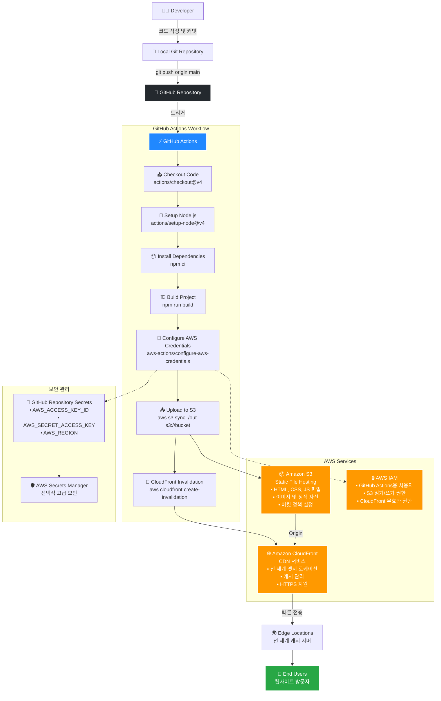
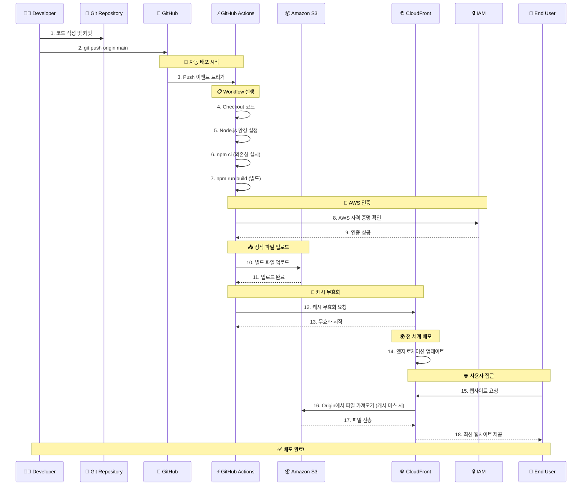

# front_5th_chapter4-1

## 프론트엔드 배포 파이프라인

### 개요
#### 파이프라인 다이어그램 (diagrams)

### 파이프라인 다이어그램 자세한 버전

#### 파이프라인 시퀀스 다이어그램

graph TD
  GIT[Git Repository]
  GHA[GitHub Actions]
  IAM[AWS IAM]
  S3[S3 버킷 (정적 파일 저장)]
  CF[CloudFront (CDN)]
  USER[사용자]

  %% 흐름
  GIT --> GHA
  GHA -->|빌드 & 배포| S3
  GHA -->|캐시 무효화| CF
  GHA -->|IAM 역할로 접근| IAM

  %% AWS 내부
  S3 -->|정적 파일 제공| CF
  CF -->|최신 정적 파일 전달| USER

#### 1. GitHub Actions
워크플로우 구성: main 브랜치에 push 이벤트가 발생하면 배포가 자동으로 진행됩니다.  
주요 작업:
Checkout: 저장소 코드를 내려받습니다.  
npm ci: 프로젝트 의존성 설치  
npm run build: Next.js 빌드 산출물 생성  
AWS 자격 증명 설정 및 S3에 업로드  
CloudFront 캐시 무효화로 최신 파일을 배포  

#### 2. Amazon S3
Next.js 빌드된 정적 파일을 저장하는 버킷 역할을 합니다.
정적 자산(HTML, JS, CSS)을 S3에서 호스팅합니다.

#### 3. Amazon CloudFront
S3에서 가져온 파일을 전 세계 엣지 서버로 배포합니다.
사용자에게 더 빠르고 안정적으로 콘텐츠를 전달합니다.
새로 배포된 파일로 캐시 무효화가 진행됩니다.

#### 4. IAM과 보안
GitHub Actions가 S3와 CloudFront에 접근할 수 있도록 IAM 역할(정책)을 구성했습니다.
AWS Secrets Manager나 GitHub Repository Secrets를 활용해 자격 증명을 안전하게 관리합니다.

### 주요 링크

- S3 버킷 웹사이트 엔드포인트: http://hanghae-yubin-bucket.s3-website-us-east-1.amazonaws.com
- CloudFrount 배포 도메인 이름: https://d116nkzjkpdj0x.cloudfront.net

### 주요 개념

- #### GitHub Actions과 CI/CD 도구

  GitHub Actions는 GitHub에서 제공하는 자동화 워크플로 도구입니다.
  CI(지속적 통합), CD(지속적 배포)를 자동화해주는 역할을 합니다.
  예를 들어, 코드 push 시 자동으로 테스트, 빌드, 배포 과정을 실행합니다.
  이를 통해 배포 오류를 줄이고, 일관된 개발 파이프라인을 유지할 수 있습니다.

- #### S3와 스토리지

  S3는 Amazon Web Services의 객체 스토리지 서비스입니다.
  정적 웹사이트 파일(html, css, js)이나 이미지, 동영상 같은 파일을 저장·서빙합니다.
  높은 내구성(99.999999999%)과 가용성을 제공해, 안전하게 정적 파일을 저장할 수 있습니다.

- #### CloudFront와 CDN

  CloudFront는 AWS의 CDN(콘텐츠 전송 네트워크) 서비스입니다.
  S3 같은 저장소에서 정적 파일을 가져와 전 세계 엣지 로케이션으로 배포해, 사용자에게 더 빠르게 콘텐츠를 전달합니다.
  CDN은 글로벌 사용자에게 콘텐츠를 빠르게 제공하고, 서버 부하를 줄여줍니다.

- #### 캐시 무효화(Cache Invalidation)

  캐시 무효화는 CDN이나 브라우저에 저장된 캐시를 지우는 작업입니다.
  사이트를 업데이트하면, 사용자에게 이전 버전 캐시가 남아있을 수 있습니다.
  이때 캐시 무효화를 통해 최신 콘텐츠로 빠르게 갱신할 수 있습니다.
  예) CloudFront의 Invalidation API를 사용해서 특정 경로 캐시를 제거.

- #### Repository secret과 환경변수
  
  Repository secret은 GitHub Actions 등에서 민감 정보를 안전하게 관리하는 방식입니다.
  예를 들어, 배포용 API 키, 데이터베이스 비밀번호 등을 저장하고, 워크플로에서 환경 변수로 불러와 사용합니다.
  이를 통해 보안을 유지하면서도 자동화 파이프라인을 안전하게 실행할 수 있습니다.

- #### Route53과 DNS 서비스
  
  Route 53은 AWS의 DNS(도메인 네임 시스템) 관리 서비스입니다.
  S3 또는 CloudFront에 배포된 웹사이트에 도메인(예: www.example.com)을 연결할 수 있습니다.
  사용자는 Route 53을 통해 사용자 지정 도메인과 연결된 트래픽을 전 세계적으로 안정적이고 빠르게 라우팅할 수 있습니다.
  실무에선 Route 53을 사용해 도메인 등록 → S3/CloudFront와 연결 → HTTPS 인증서 발급까지 진행하는 경우가 많습니다.

### CDN과 성능최적화

##### S3와 CloundFront

#### 첫 화면 로딩 (HTML 문서)

| 비교 지점         | S3 직접 배포             | CloudFront (CDN) 배포 |
| ----------------- | ------------------------ | --------------------- |
| **document**      | 13.4KB, 응답 203ms       | 3.4KB, 응답 17ms      |
| **document 응답** | S3 직접 응답 (us-east-1) | CDN 엣지 서버 응답    |

#### JS / CSS / Font / 이미지 리소스

| 리소스 유형    | S3 직접 배포                        | CloudFront (CDN) 배포               |
| -------------- | ----------------------------------- | ----------------------------------- |
| **CSS**        | f5851670bcc5d7e2.css, 200 응답, 0ms | f5851670bcc5d7e2.css, 200 응답, 0ms |
| **JS**         | 8개 정도의 JS 파일, 200 응답, 0ms   | 8개 정도의 JS 파일, 200 응답, 0ms   |
| **Font / svg** | font, svg 등도 0ms 응답             | font, svg 등도 0ms 응답             |

S3는 HTML(document)만 네트워크 딜레이(203ms)가 보였고, 나머지는 브라우저 메모리 캐시로 인해 0ms로 보였습니다.
CloudFront도 HTML(document) 요청만 실제 엣지에서 빠른 응답(17ms)이 확인되었고, 나머지는 메모리 캐시로 0ms.

#### 네트워크 타임라인 및 성능 차이

| 비교 지점       | S3 직접 배포                                        | CloudFront (CDN) 배포                  |
| --------------- | --------------------------------------------------- | -------------------------------------- |
| **최초 요청**   | 200ms 이상                                          | 17ms로 매우 빠름                       |
| **정적 리소스** | 메모리 캐시로 인해 0ms 응답                         | 메모리 캐시로 인해 0ms 응답            |
| **콘텐츠 위치** | S3 (us-east-1, AWS 리전)                            | 전 세계 CDN 엣지 로케이션              |
| **사용자 경험** | 지역적으로는 빠름, 글로벌 사용자에게는 느릴 수 있음 | 전 세계 어디서나 빠른 응답 (캐시 덕분) |

#### 결론

이번 비교에서 CloudFront를 도입하면 S3에서 HTML 파일만 직접 가져오던 때보다 첫 화면 로딩 속도가 203ms → 17ms로 줄었습니다. 정적 리소스(JS/CSS)는 캐시가 적용되어 양쪽 모두 0ms였지만, CDN을 통해 전 세계 사용자에게 동일한 빠른 응답을 제공할 수 있습니다. CDN은 사용자 체감 성능을 높이고 서버 트래픽을 줄여주는 효과를 확인할 수 있었습니다.
